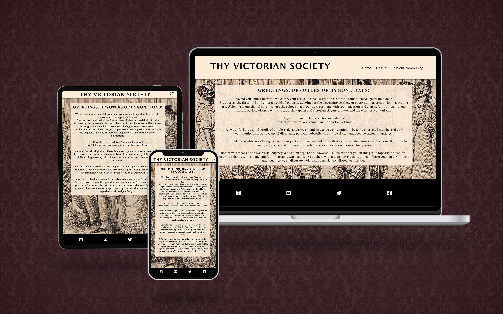
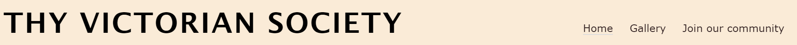
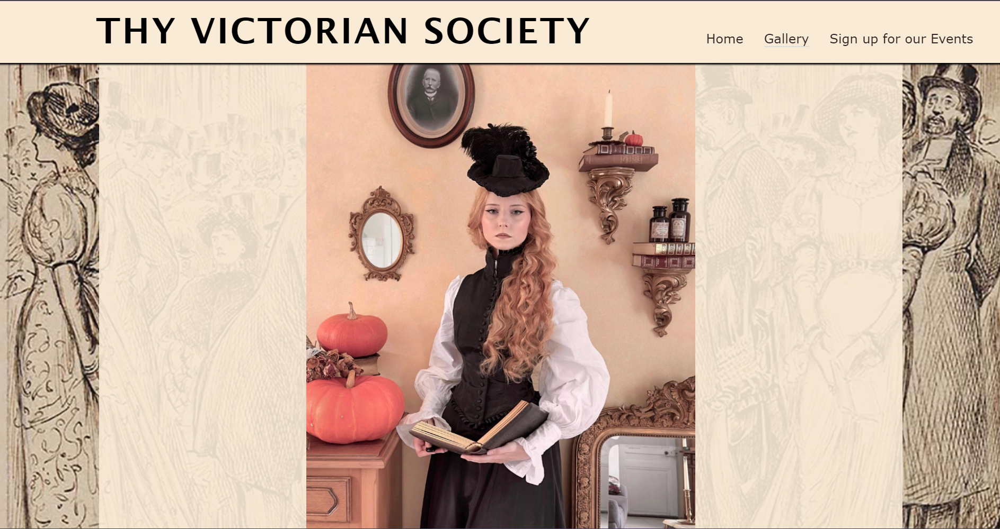
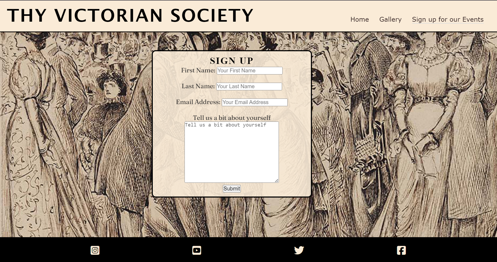
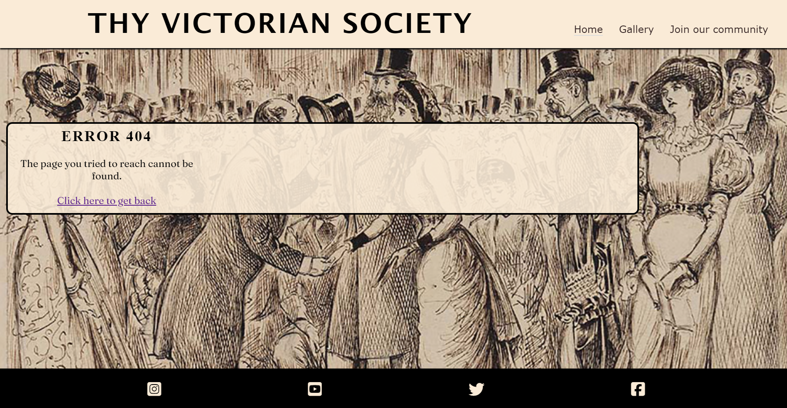
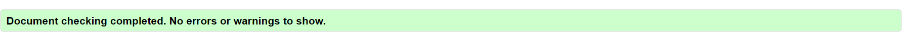

# THY VICTORIAN SOCIETY
## A space for lovers of a bygone era!

You can reach the page [here](https://beondska.github.io/thyvictoriansociety-PP1/index.html)

 Table of Contents
1. [Introduction](#introduction)
2. [About](#about)
3. [Features](#features)
4. [User Experience (UX)](#user-experience-ux)
5. [Testing](#testing)
6. [Known Issues](#known-issues)
7. [Deployment](#deployment)
8. [Media](#media)
9. [Credits & Acknowledgements](#credits--acknowledgements)

# INTRODUCTION
The Victorian era, in British history, is the period corresponding roughly but not exactly to the period of Queen Victoria's reign (1837–1901) and had fashion impact around the world since.

The intention behind this project is to reach out the majority of enthusiastic and admires of the Victorian Era and build a community, exchange experiences and be able to participate in events related to that.

# ABOUT
This project is an extension of my love and the hobby I cultivated throw the years of my life and that increased during the pandemic time when we all had to be recluse, and I had the privilege to be able to use my time to learn how to sue, create and make clothes and some stays-corset from the Victorian Age Epoch.

# FEATURES

Starting with **Nav Bar**
This header exists on every page.

- Present on the pages, the nav bar is fully accessible and responsive for users to navigate through the website.
- The links also has a hover effect when having your mouse pointer of the header colors with the overall theme.
- It brings the user to Home, Gallery, Join our Community pages and also a 404 Error page.
- The whole site is responsive and works well for all kind of different devices.

Next, we have **Hero Image**

- This beautiful image anchors all the pages to capture's the user attention. Author is anonymous.

Furthermore, **The Footer**
This footer exists on every page.
- This directs the user to our external social media links, in order: Instagram, YouTube, Twitter and Facebook pages.

Moving on, we have the  **Gallery**
- The gallery features multiple images of our past events on the website.
- There is responsive media coding to help scale the content for mobile and website.

Last but not least **Join our community section**
- This section consist of a header and a form for the visitor to sign up to our newsletter and tells us a bit about themselves.
- There is an input-fields that was required so the user fill up his information in all fields for it to be able to submit.

**Error 404**
- This section consist of an Error page. Information is shown when the user inputs a non existing webpage.
- Alert and information that the page cannot be reached and also a link to take the user back to the homepage.

# TESTING
**Navigation Links**

Testing was performed to ensure all navigation links on the respective pages navigated to the correct pages as per design. This was done by clicking on the navigation links on each page.

| Navigation Link    | Page to Load  |
| -----------------  |---------------|
| Home               | index.html    |
| Gallery            | gallery.html  |
| Join our community | signup.html   |

Links on all pages navigated to the correct pages as expected.

###  W3C Validator
[WC3](https://validator.w3.org/) was used to validate all HTML and CSS.

Both CSS and all of the HTML pages: index.html , gallery.html, signup.html and 404.html no errors were founded.

**Responsiveness**

All pages were tested to ensure responsiveness on screen sizes as defined in WCAG 2.1 Reflow criteria for responsive design on Chrome, Edge, Firefox and Safari browsers. No horizontal scroll is present. No elements overlap.

# KNOWN ISSUES
In my first experience using GitHub, I initially misunderstood the process. I thought that even minor changes, such as fixing a typo or coding a single line, required committing and pushing to see the effects on my local copy of the website. So I thought I was doing something wrong, and I deleted the entire project and started over.
This is my first ever website project and I struggled with terms of coding and the design aspects mirroring from HTML to CSS files. I have learned a lot from this, however there are still present issues on the website and I do hope to have the knowledge and focus on solving.

# DEPLOYMENTS
I published the GitHub page with my website by going to my repository settings and under the code and automations, thus deploying the website to be live.

# MEDIA
All images on the Gallery page were taken by me, Bianca Betinelli and my dear friend Caroline Daleffe, and therefore it is our work that are displayed.

# CREDITS AND ACKNOWLEDGEMENTS
I would like to extend some thanks, not only to the online resources, but also to my husband and best friend, Herick Zerunian that helped me during this project being my first fan, motivational and emotional support. Also, to my friend Caroline for the great energy and friendship throw the years. To my friend Tania that has taking her personal time to teach me suing stays corsets, clothes and so much more about the Victorian Era that we both hold dear. To my mentor Rory Patrick who aided me when everything was a bit chaotic and some of my new "Slack" friends, expecially Andreas that aided me when I needed the most.
